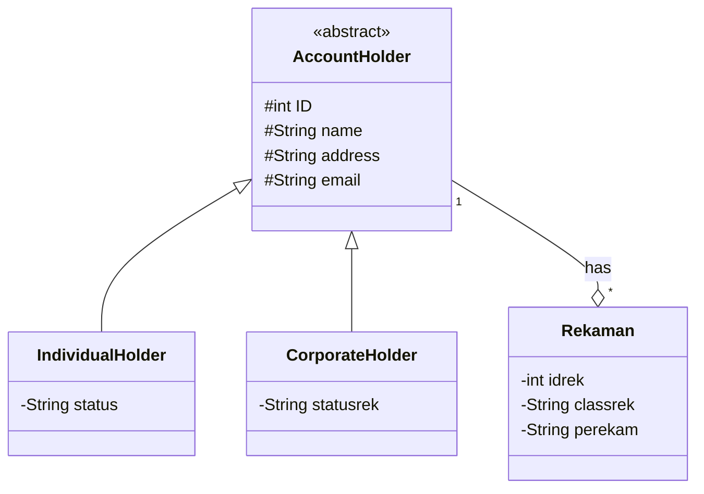

# antrianktp-dosen-

# NAMA ANGGOTA

-Dirga Wira Aditya 
-Mahesa Yudhistira 
-Rendy Fitra Adi Pratama 

# CLASS DIAGRAM


# ER DIAGRAM
```mermaid
erDiagram
          ACCOUNTHOLDER ||..|| INDIVIDUAL-HOLDER : is
          ACCOUNTHOLDER ||--|| CORPORATE-HOLDER : is
          ACCOUNTHOLDER ||--|{ REKAMAN: "has"
          ACCOUNTHOLDER {
            int id
            string name
            string adress
            string email
          }
          INDIVIDUAL-HOLDER{
            string status
          }
          CORPORATE-HOLDER{
            string statusrek
          }
           CLASS{
            int idrek
            string classrek
            string perekam
          }
```          
